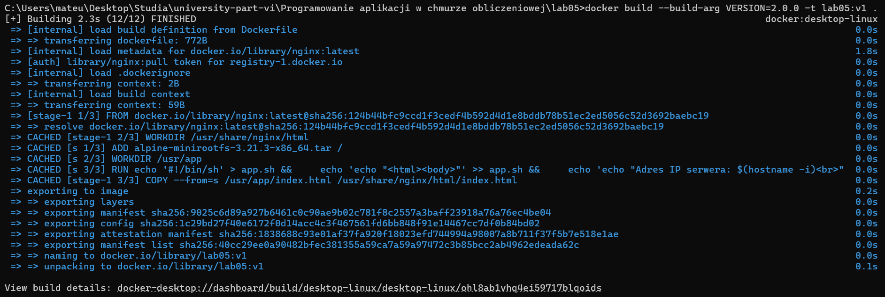
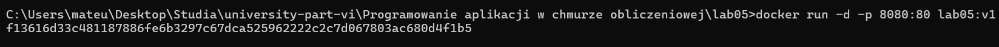
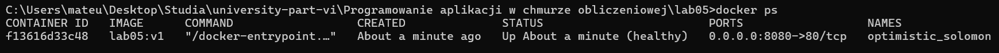
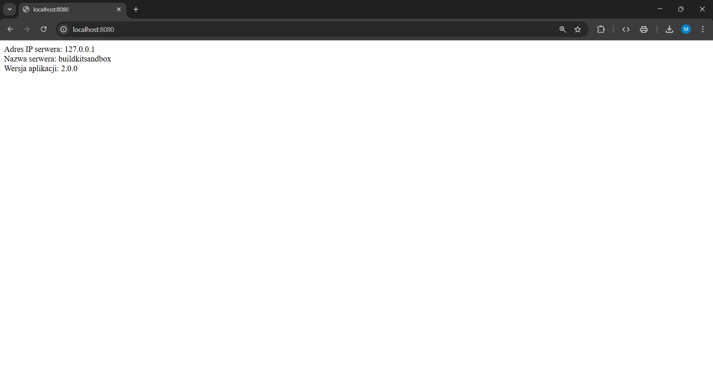

<h1 align="center">
    Zadanie Obowiązkowe z Laboratorium 5
</h1>

Polecenie użyte do budowy obrazu z określoną wersją aplikacji poprzez nadanie wartości zmiennej VERSION definiowanej przez instrukcje ARG:

```bash
docker build --build-arg VERSION=2.0.0 -t lab05:v1 .
```

Poniżej znajduje się zrzut ekranu przedstawiający działanie polecenia:


Polecenie uruchamiające serwer:

```bash
docker run -d -p 8080:80 lab05:v1
```

Poniżej znajduje się zrzut ekranu przedstawiający działanie polecenia:


Polecenie sprawdzające działanie kontenera:

```bash
docker ps
```

Poniżej znajduje się zrzut ekranu przedstawiający działanie polecenia:


Zrzut ekranu potwierdzający, że aplikacja realizuje wymaganą funkcjonalność:

