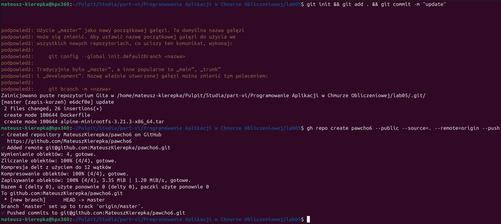
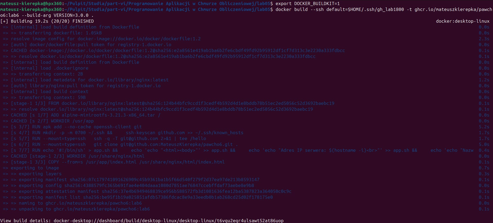
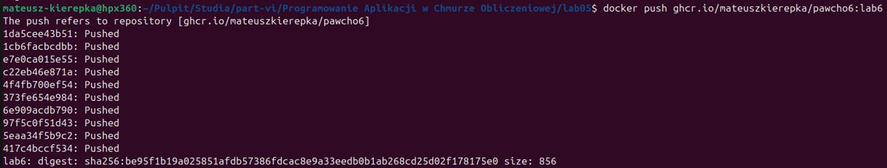
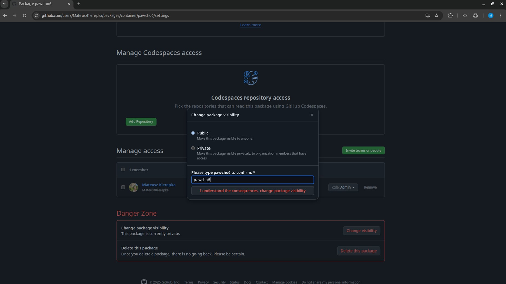
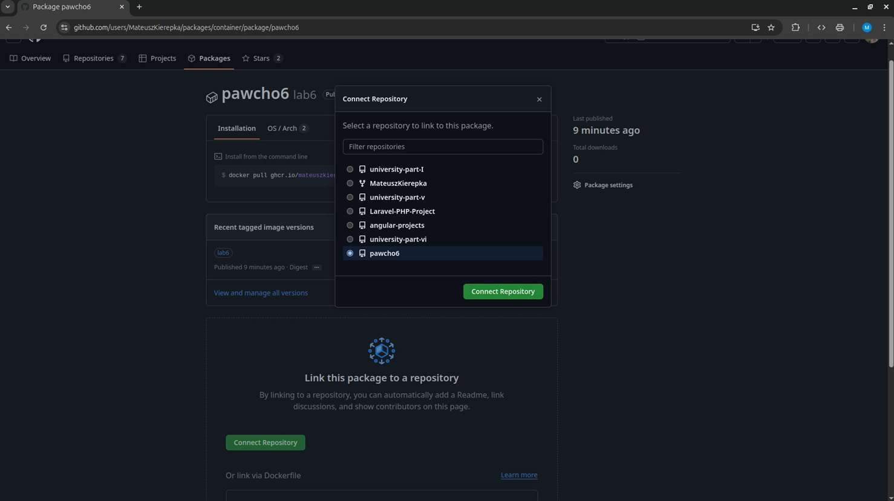

# Laboratorium 6 - Konfiguracja i wykorzystanie klienta CLI dla usług Github. Rejestr obrazów ghcr.io - zasady konfiguracji i korzystania. Deklarowanie użycie secrets w plikach Dockerfile oraz w procesie budowania obrazów. Zasady tworzenia rozszerzonych frontend-ów.

## Opis zadania

1. Utworzenie publicznego repozytorium na GitHub o nazwie `pawcho6` za pomocą klienta CLI `gh` i powiązanie go z katalogiem zawierającym rozwiązanie zadania obowiązkowego z laboratorium 5.



2. Modyfikacja istniejącego pliku `Dockerfile` tak, aby pełnił rolę frontendu dla silnika BuildKit.

```dockerfile
# syntax=docker/dockerfile:1.2
```

3. Dodanie do pliku `Dockerfile` instrukcji umożliwiających pobranie zawartości repozytorium `pawcho6` za pomocą protokołu SSH i zbudowanie obrazu Docker na jego podstawie.

```dockerfile
RUN apk add --no-cache openssh-client git

RUN mkdir -p -m 0700 ~/.ssh && \
    ssh-keyscan github.com >> ~/.ssh/known_hosts

RUN --mount=type=ssh \
  ssh -q -T git@github.com 2>&1 | tee /hello

RUN --mount=type=ssh \
  git clone git@github.com:MateuszKierepka/pawcho6.git .
```

4. Nadanie zbudowanemu obrazowi tagu `lab6` i przesłanie go do repozytorium obrazów na GitHub (repo: `ghcr.io`).




5. Zmiana atrybutu dostępu do obrazu w repozytorium GitHub z `private` na `public`.



6. Powiązanie repozytorium obrazów z utworzonym repozytorium Git o nazwie `pawcho6`.


