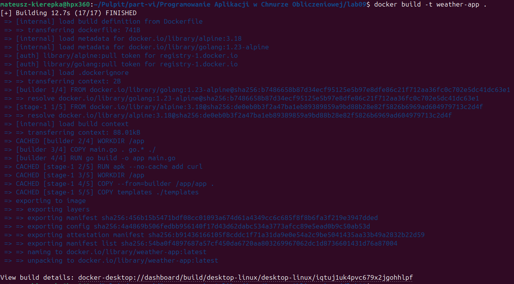
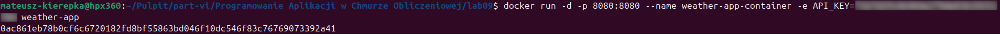
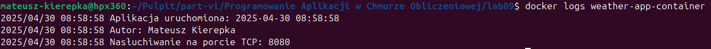
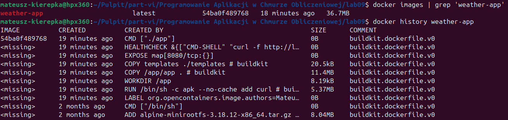
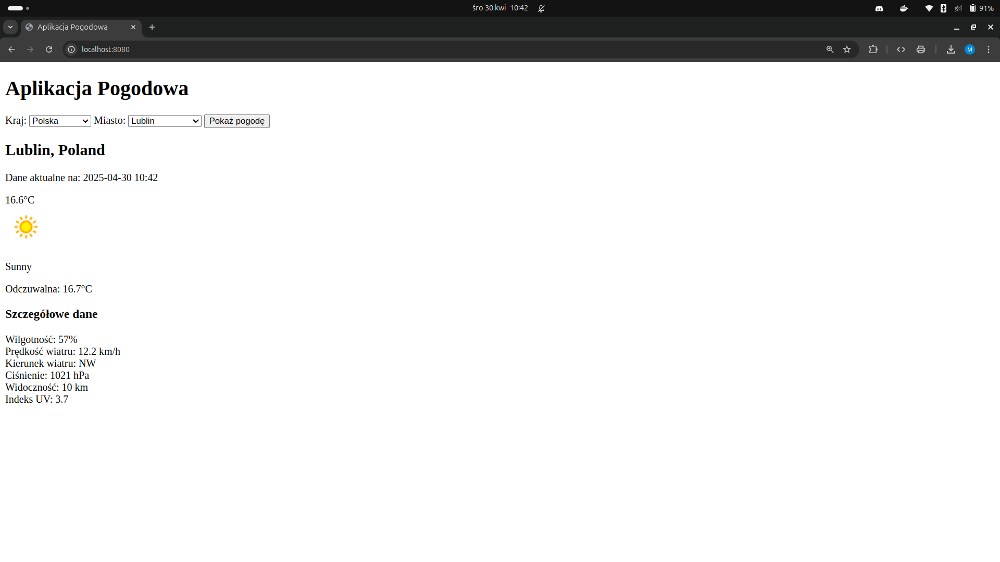

# README - Realizacja zadania 1. - część obowiązkowa

## Podpunkt 3.

### a. Zbudowanie opracowanego obrazu kontenera
```bash
docker build -t weather-app .
```



### b. Uruchamianie kontenera na podstawie zbudowanego obrazu
```bash
docker run -d -p 8080:8080 --name weather-app-container -e API_KEY=****************** weather-app
```
> **Uwaga:** Pod `API_KEY` podstawić rzeczywisty klucz API do usługi pogodowej



### c. Uzyskanie informacji z logów
```bash
docker logs weather-app-container
```



### d. Sprawdzenie, ile warstw posiada zbudowany obraz oraz jaki jest rozmiar obrazu
```bash
docker images | grep 'weather-app'
docker history weather-app
```



## Działanie aplikacji w przeglądarce
Po uruchomieniu kontenera aplikacja będzie dostępna pod adresem: [http://localhost:8080](http://localhost:8080).

Poniżej znajduje się zrzut ekranu przedstawiający działanie aplikacji w oknie przeglądarki:

