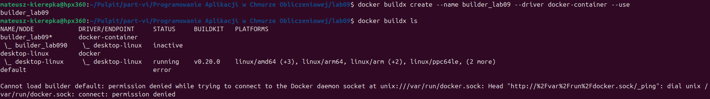
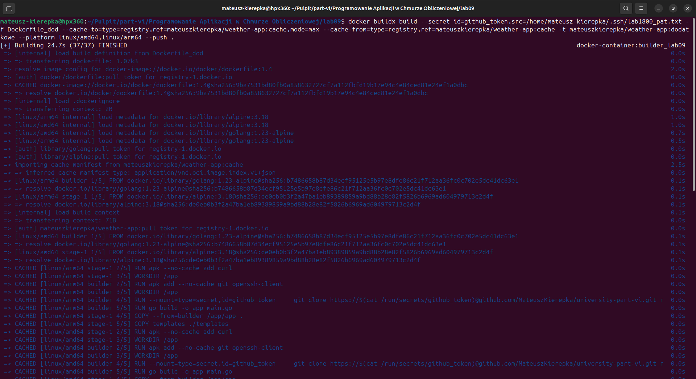
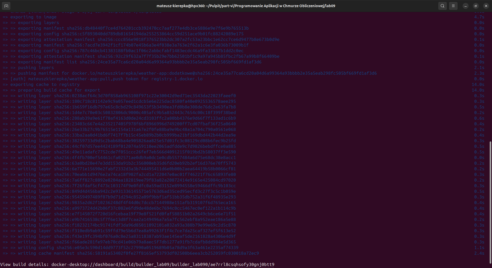
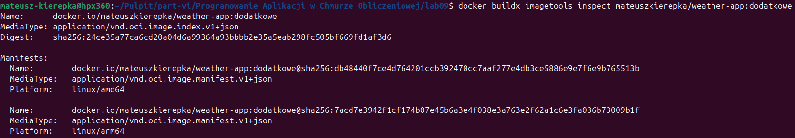
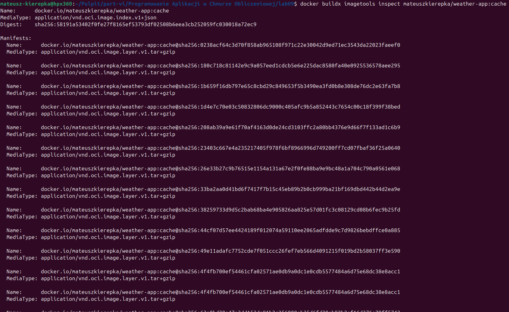
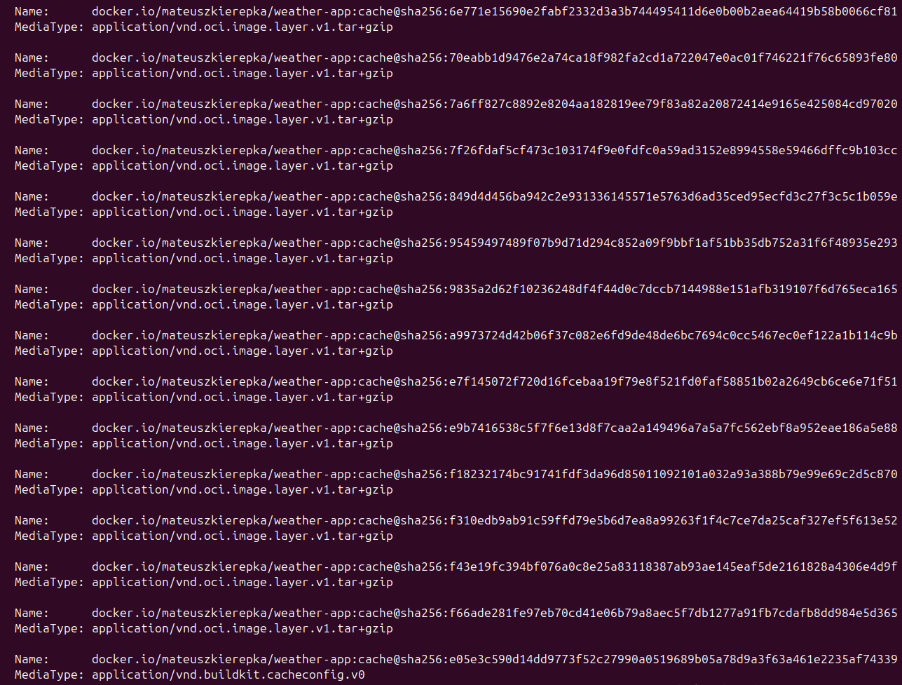
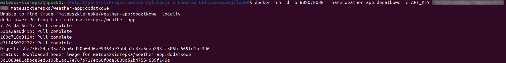
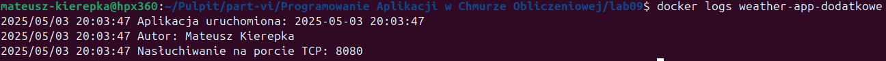
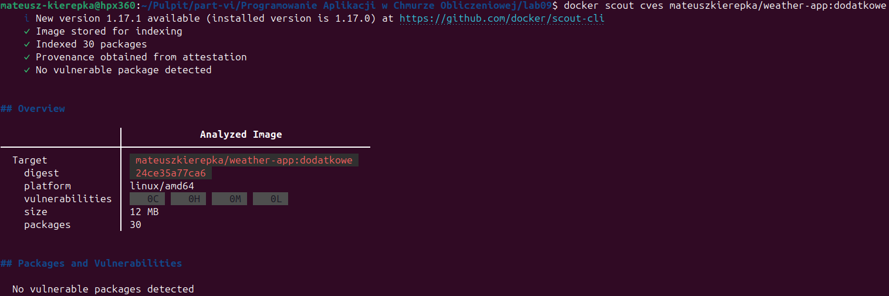
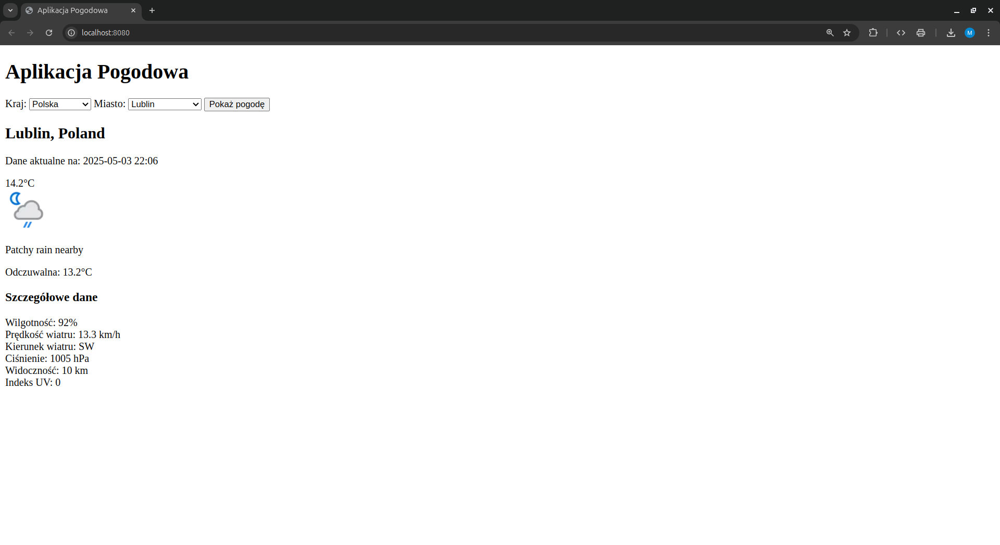

# README - Realizacja zadania 1. - część dodatkowa

## Stworzenie buildera opartego na sterowniku docker-container

```bash
docker buildx create --name builder_lab09 --driver docker-container --use
```



## 1. Zbudowanie obrazu z wykorzystaniem buildera opartego na sterowniku docker-container

```bash
docker buildx build --secret id=github_token,src=/home/mateusz-kierepka/.ssh/lab1800_pat.txt -f Dockerfile_dod --cache-to=type=registry,ref=mateuszkierepka/weather-app:cache,mode=max --cache-from=type=registry,ref=mateuszkierepka/weather-app:cache -t mateuszkierepka/weather-app:dodatkowe --platform linux/amd64,linux/arm64 --push .
```




## 2. Weryfikacja manifestu obrazu

```bash
docker buildx imagetools inspect mateuszkierepka/weather-app:dodatkowe
```



Wynik polecenia potwierdza, że manifest zawiera deklaracje dla dwóch platform sprzętowych: linux/arm64 oraz linux/amd64

## 3. Sprawdzenie wykorzystania obrazu z danymi cache

```bash
docker buildx imagetools inspect mateuszkierepka/weather-app:cache
```




## 4. Uruchomienie kontenera

```bash
docker run -d -p 8080:8080 --name weather-app-dodatkowe -e API_KEY=***************** mateuszkierepka/weather-app:dodatkowe
```



## 5. Sprawdzenie logów kontenera

```bash
docker logs weather-app-dodatkowe
```



Logi potwierdzają, że aplikacja została uruchomiona poprawnie, a autor czas i port są wyświetlane zgodnie z wymaganiami.

## 6. Analiza podatności na zagrożenia

```bash
docker scout cves mateuszkierepka/weather-app:dodatkowe
```



## 7. Działanie aplikacji w przeglądarce

Po uruchomieniu kontenera aplikacja będzie dostępna pod adresem: [http://localhost:8080](http://localhost:8080).

Poniżej znajduje się zrzut ekranu przedstawiający działanie aplikacji w oknie przeglądarki:


