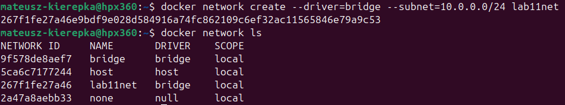
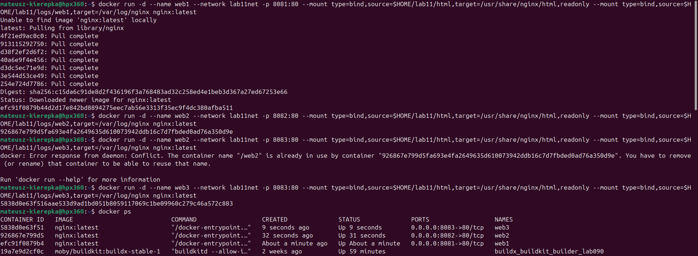
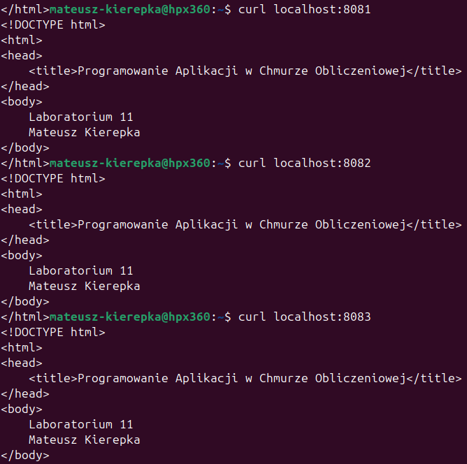
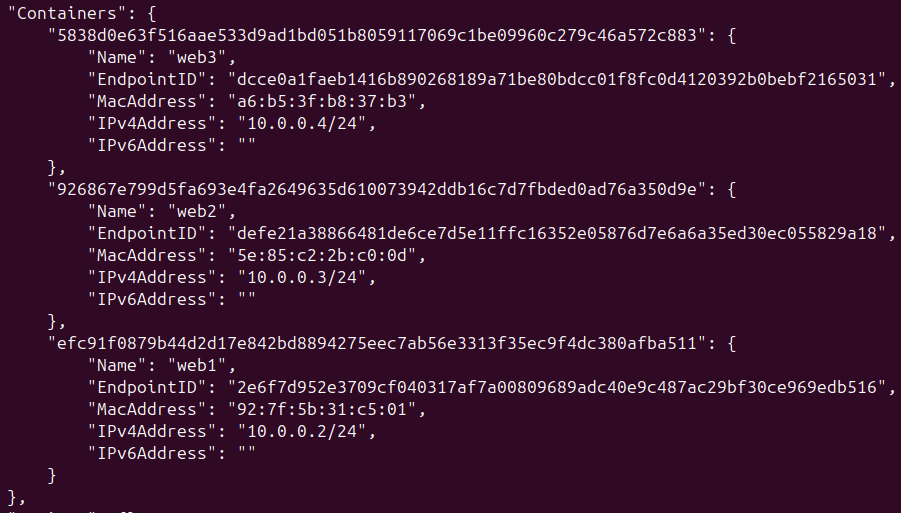
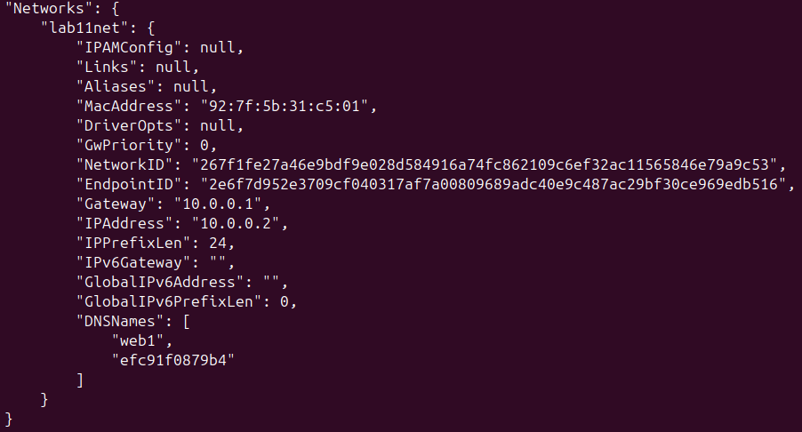
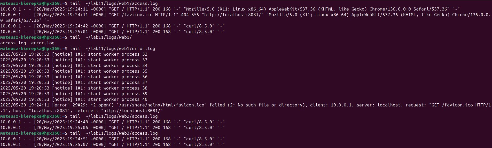

# Realizacja zadania obowiązkowego z laboratorium 11

### Należy uruchomić trzy kontenery o nazwach odpowiednio: web1, web2, web3, które zawierać będą serwery nginx w wersji latest w taki sposób by:

#### • wszystkie te serwery były podłączone do jednej sieci mostkowej definiowanej przez użytkownika (nazwa sieci: lab11net)

#### • wszystkie serwery były dostępne z sieci zewnętrznej (z poziomu używanego komputera, laptopa)

#### • poszczególne serwery wyświetlały prosta stronę html zawierającą: numer laboratorium, imię i nazwisko studenta a strona ta została podłączona do każdego z serwerów nginx wykorzystując wolumeny z uprawnieniami dostępu: read-only

#### • poszczególne serwery zapisywały logi do trzech dedykowanych katalogów w podkatalogu katalogu domowego o nazwie lab11. Katalog lab11 ma zostać dołączony do kontenerów również wykorzystując wolumeny

```bash
docker network create --driver=bridge --subnet=10.0.0.0/24 lab11net
```



```bash
mkdir -p ~/lab11
mkdir -p ~/lab11/logs/web1 ~/lab11/logs/web2 ~/lab11/logs/web3 ~/lab11/html
```

```bash
docker run -d --name web1 --network lab11net -p 8081:80 --mount type=bind,source=$HOME/lab11/html,target=/usr/share/nginx/html,readonly --mount type=bind,source=$HOME/lab11/logs/web1,target=/var/log/nginx nginx:latest
```

```bash
docker run -d --name web2 --network lab11net -p 8082:80 --mount type=bind,source=$HOME/lab11/html,target=/usr/share/nginx/html,readonly --mount type=bind,source=$HOME/lab11/logs/web2,target=/var/log/nginx nginx:latest
```

```bash
docker run -d --name web3 --network lab11net -p 8083:80 --mount type=bind,source=$HOME/lab11/html,target=/usr/share/nginx/html,readonly --mount type=bind,source=$HOME/lab11/logs/web3,target=/var/log/nginx nginx:latest
```



```bash
curl localhost:8081
curl localhost:8082
curl localhost:8083
```



```bash
docker network inspect lab11net
```



```bash
docker container inspect web1
```



```bash
tail ~/lab11/web1/access.log
tail ~/lab11/web1/error.log
```


