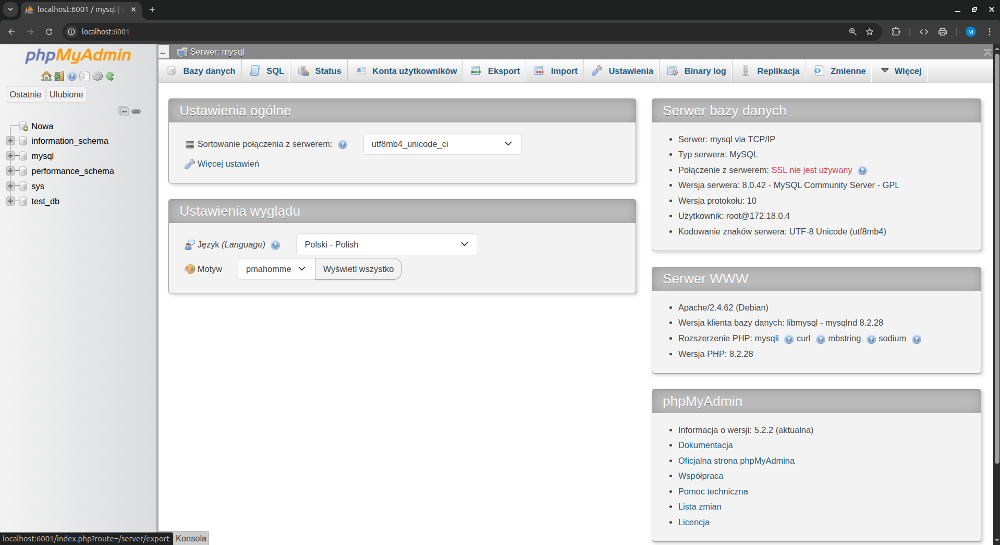

# Realizacja zadania obowiązkowego z laboratorium 12

### Zbudowano plik docker-compose.yml, który uruchamia stack LEMP wraz z phpMyAdmin.

Stack LEMP składa się z następujących usług składowych:
- L – dla Linux
- E – dla Nginx
- M – dla MySQL
- P – dla PHP

Aplikacja zawiera cztery kontenery (mikrousługi):
- jeden kontener dla Nginx
- jeden kontener dla PHP (PHP-FPM)
- jeden kontener dla MySQL
- jeden kontener dla phpMyAdmin

### Zrealizowane założenia:
- Wykorzystano obrazy ze zdefiniowanym tag-iem z DockerHub
- Skonfigurowano sieci: PHP i MySQL w sieci backend, Nginx i phpMyAdmin w sieciach backend i frontend
- Nginx został skonfigurowany na porcie 4001
- Skonfigurowano wyświetlanie strony startowej php (index.php)
- phpMyAdmin został skonfigurowany na porcie 6001 z możliwością logowania i zarządzania bazą danych

### Przebieg realizacji:

1. Uruchomienie stack-a LEMP:
```bash
docker compose up -d
```


2. Weryfikacja działania stack-a LEMP - sprawdzenie strony głównej:


3. Weryfikacja działania phpMyAdmin i bazy danych:


4. Zatrzymanie i usunięcie kontenerów:
```bash
docker compose down
```


### Podsumowanie realizacji:

1. Stack LEMP został poprawnie skonfigurowany i uruchomiony:
   - Nginx działa na porcie 4001
   - phpMyAdmin działa na porcie 6001
   - Strona testowa wyświetla się poprawnie

2. Konfiguracja sieci:
   - PHP i MySQL są w sieci backend
   - Nginx i phpMyAdmin są w sieciach backend i frontend
   - Wszystkie usługi są dostępne z zewnątrz na odpowiednich portach

3. Baza danych:
   - Utworzona została testowa baza `test_db`
   - Dostęp do bazy możliwy przez phpMyAdmin
   - Dane dostępowe skonfigurowane poprawnie

4. Wszystkie kontenery zostały pomyślnie uruchomione i zatrzymane
