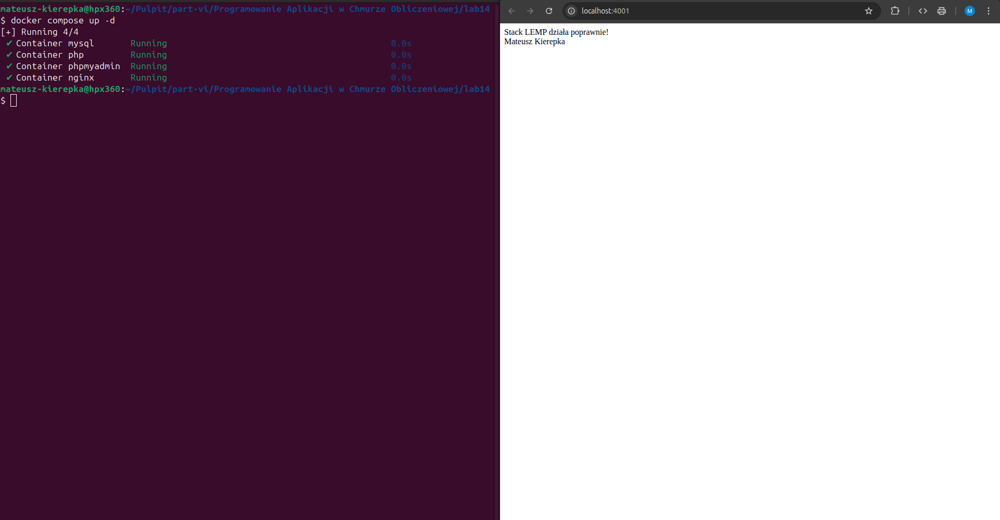
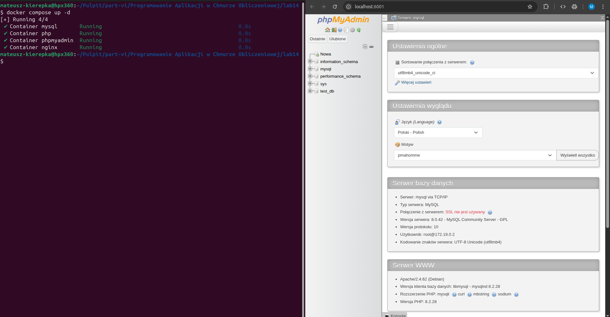

# Realizacja zadania nieobowiązkowego z laboratorium 12

### Zbudowano pliki bazowy docker-compose.yml i override docker-compose.override.yml, które uruchamiają stack LEMP wraz z phpMyAdmin. Dane dostępowe do bazy są przekazywane jako zmienne środowiskowe.

Stack LEMP składa się z następujących usług składowych:

- L – dla Linux
- E – dla Nginx
- M – dla MySQL
- P – dla PHP

Aplikacja zawiera cztery kontenery (mikrousługi):

- jeden kontener dla Nginx
- jeden kontener dla PHP (PHP-FPM)
- jeden kontener dla MySQL
- jeden kontener dla phpMyAdmin

### Zrealizowane założenia:

- Wykorzystano obrazy ze zdefiniowanym tag-iem z DockerHub
- Skonfigurowano sieci: PHP i MySQL w sieci backend, Nginx i phpMyAdmin w sieciach backend i frontend
- Nginx został skonfigurowany na porcie 4001
- Skonfigurowano wyświetlanie strony startowej php (index.php)
- phpMyAdmin został skonfigurowany na porcie 6001 z możliwością logowania i zarządzania bazą danych
- Dane dostępowe (hasła) są przekazywane jako zmienne środowiskowe
- Zastosowano mechanizm merge Docker Compose poprzez podział konfiguracji na plik bazowy i override

### Przebieg realizacji:

1. Uruchomienie stack-a LEMP:

   Możliwe są dwa sposoby uruchomienia:

   a) Automatyczne łączenie plików (zalecane przy użyciu standardowej konwencji nazewnictwa):

   ```bash
   docker compose up -d
   ```

   b) Jawne określenie plików do połączenia:

   ```bash
   docker compose -f docker-compose.yml -f docker-compose.override.yml up -d
   ```

   Oba sposoby dają identyczny rezultat, ponieważ Docker Compose automatycznie łączy pliki zgodnie z konwencją nazewnictwa.

2. Weryfikacja działania stack-a LEMP - sprawdzenie strony głównej:



3. Weryfikacja działania phpMyAdmin i bazy danych:



4. Zatrzymanie i usunięcie kontenerów:

```bash
docker compose down
```

### Podsumowanie realizacji:

1. Stack LEMP został poprawnie skonfigurowany i uruchomiony:

   - Nginx działa na porcie 4001
   - phpMyAdmin działa na porcie 6001
   - Strona testowa wyświetla się poprawnie

2. Konfiguracja sieci:

   - PHP i MySQL są w sieci backend
   - Nginx i phpMyAdmin są w sieciach backend i frontend
   - Wszystkie usługi są dostępne z zewnątrz na odpowiednich portach

3. Baza danych:

   - Utworzona została testowa baza `test_db`
   - Dostęp do bazy możliwy przez phpMyAdmin
   - Dane dostępowe skonfigurowane poprawnie

4. Bezpieczeństwo:

   - Hasła i dane są przekazywane jako zmienne środowiskowe

5. Mechanizm merge Docker Compose:

   - Plik bazowy (docker-compose.yml) zawiera podstawową konfigurację usług
   - Plik override (docker-compose.override.yml) zawiera specyficzne ustawienia środowiskowe
   - Automatyczne łączenie plików przy użyciu standardowej konwencji nazewnictwa
   - Możliwość jawnego określenia plików do połączenia za pomocą flagi -f

6. Wszystkie kontenery zostały pomyślnie uruchomione i zatrzymane
